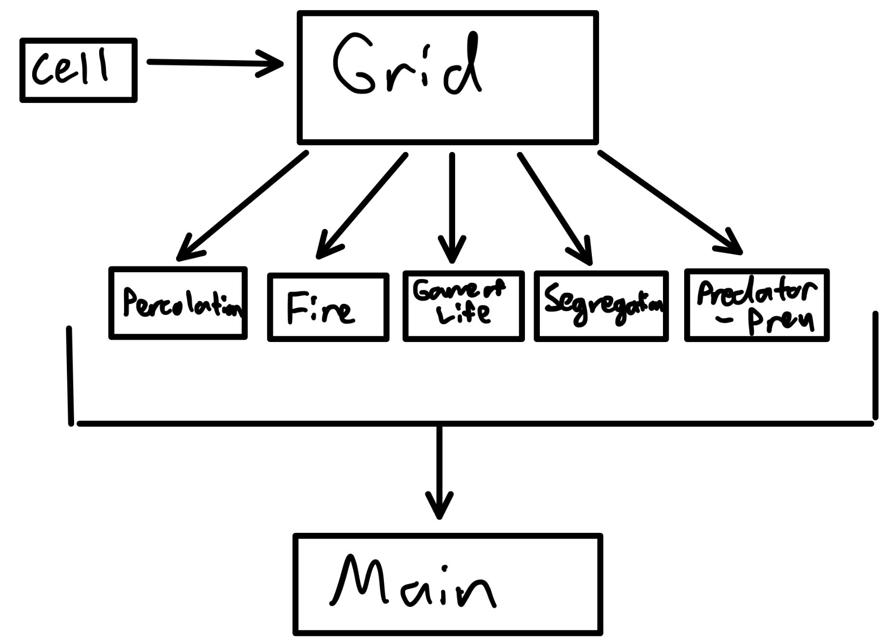

# Simulation Design Plan
### Team Number 04
### Names: Eric Doppelt, Varun Kosgi, Jaidha Rosenblatt
### NetIds: ead45, vsk10, jrr59 

## Introduction
The Cellular Automata is a simulation consisting of multiple cells in a grid that can interact with their neighbors to change their states. The purpose of our program will be to present the user with a Graphical User Interface, load a Configuration file that dictates the rules for the simulation, run the aforementioned simulation, and present an indefinite visualization of the constantly updating grid.

The focus of our design is to create a flexible "open" structure that supports adding new types of simulations without having to change significant functionality of the Main class. We will keep the implementation of the grid and cells "closed" so that it can only be updated by adding new rules to our simulation.

## Overview

We plan on incorporating three major class types in our project. We will have a Cell class that holds a state and a color. An abstract Grid class will be a 2D array of Cell objects. We will inherit the abstract Grid class for each of the simulation types and use it to set the specific rules for each simulation type. In main, we load in the XML file, use it to set the current Grid type and control the animation of grid.

* Cell
    * Smallest Unit
    * Holds variables representing current state and color
    * Method updateCell() allows for a change of state

* Grid (Abstract)
    * Collection of cell objects arranged in a 2D grid
    * getGrid() returns the grid at an instant
    * getScene() returns JavaFX visualization of grid as a scene
    * updateGrid() check neighboring cell states of each cell and updates based on interaction rules
    * handleMiddleCell() and handleEdgeCase() switch case to avoid index out of bounds error

* Grid subclasses
    * Represents different simulation types
    * Interprets the configuration from XML file as constructor
    * Updates grid based on the rules from the simulation type
    * Inherits all methods from Grid 

* Main class
    * Runs JavaFX environment with animation loop
    * Creates new Grid object based on the type of game from XML file
    * Makes calls to Grid methods to update state
    * Handles GUI

#### Different Implementations
Instead of each type of grid class handling the conversion to a scene, we could create a separate class that offloads that functionality and returns a scene.

Instead of making a 2D array for our Grid, we could use an ArrayList of ArrayLists. This would enable us to dynamically grow the size of a grid. However, this would make our grid slower, since without indexing we would need to constantly be checking for the position of each cell.

Instead of passing a state and color to each Cell object from the Grid, we could instead pass just a State and allow the Cell to re-color itself. This would shift the burden of determining a Cell's color to the Cell class, where it conceptually seems to belong. The problem with this implementation, however, is that it would require a new type (new class) of Cell for each different type of Game simulation. This would require us to use inheritance within Cells just to code one method that colors a cell, so to avoid creating many small classes, we can instead have the grid communicate the color to a general Cell object instead.

## User Interface

The User Interface will consist of a JavaFX scene with an option to load a specific .cellsociety.xml configuration file. The user will be presented with a button to press that will allow them to browse their computer for a .cellsociety.xml configuration file. If the configuration file is not in the valid format, the user will get an error message prompting them to choose a file that is correctly formatted. Moreover, if the Simulation Type is not supported (does not have a corresponding GridType class), an error message will occur prompting the user to chose a simulation that exists. The user will also be able to pause and play the simulation at will by clicking. There will also be an option to speed up or slow down the simulation, in addition to an option to skip forward.

## Design Details

#### Components

 - Cell Class
     - Contains information for the state of a given cell
         - This could be encoded in a variety of types of instance variables, such as ints or Strings, for example.
     - Methods
         - public void updateCell(Color color, String state)
             - Update the color and state of a cell
         - public String getState()
             - Get the current state of the cell
         - public Color getColor()
             - Get the current color of the cell
    -    *Justification*: This class encodes the simple information that each entry in the grid has, including state and color. This allows the Grid to delegate the information to a new class when updating its state.

 - Abstract Grid Class
     - A 2D array of Cell objects
     - Each type of simulation is a new class that inherits the abstract Grid class 
     - Returns a JavaFX scene from the grid that represents the current state of the simulation
         - Could return either a Collection of Cells or a Scene to be added to the root
    - Methods:
        - public Cell[][] getGrid()
            - Returns 2d Array
        - public Scene getScene()
            - Returns a Scene representation of the Grid using Cell's stored colors to display them.
        - public abstract updateGrid()
            - Runs rules once and changes state of each cell
            - Coded in subclasses
            - Call either handleMiddleCell() or handleEdgeCell() depending on the indices for the array
        - public abstract handleMiddleCell()
            - Updates the state of a cell in the middle of the grid
        - public abstract handleEdgeCell()
         - Updates the state of a cell on the edge of the grid
         - Must be able to catch an index out of bounds error
    - *Justification:* This adds flexibility to our design and allows us to be able to implement new simulations later on. By having the main class deal with abstract grids, and having concrete grid extensions code the different rules of a simulation, we can add a new simulation type by simply adding a new subclass that extends grid. Moreover, this class encodes similarities between Grids, such as the method getGrid() which returns the 2D array (a method needed for all Grid objects, regardless of simulation type).

 - Concrete Grid subclasses
     - Extends Grid class and represents a distinct type of simulation (fire spread, population, water flow)
     - Constructor takes an XML file as a parameter which contains information that is set to instance variables for the Grid Type
     - implements updateState(), handleMiddleCell(), handleEdgeCell() method in Grid class based on rules of simulation
      - *Justification:* As mentioned above, these subclasses allow us to add future simulation types to our game. These classes encode the differences between Simulations, specifically within the updateState() method. This encodes the rules of the simulation by changing each Cell based on conditions involving their neighbors.

 - Main Class
     - Constantly updates the simulation with inputs from other classes (Simulation loop)
     - myGrid instance variable
     - Uses a JavaFX environment to present a GUI for the user
     - Handles XML file and calls appropriate grid object
     - Methods
         - private void step()
             - Uses an animation timer to run simulation
             - Calls updateGrid()
         - private Grid loadGrid(File file)
             - Read first line of the file to determine simulation type
             - Create Grid type
    - *Justification*: Since we are using JavaFX, we need a animation loop, which is implemented in the main class. Using the start() and step() methods, this class essentially runs the game smoothly using GUIs.
    
#### Use Cases

*Use Case One*
1. In Main program start(), call loadGrid() method for starting simulation
2. In loadGrid(), read top of XML file to create a GameOfLife grid object that inherits abstract Grid
3. Set this grid to myGrid instance variable
4. In step() function, updateGrid() is called on whole grid
5. Within updateGrid(), handleMiddleCell() is called for this Cell
6. Cell.setState() is called in handleMiddleCell() to set its String to "dead"

*Use Case Two*
1. In Main program start(), call loadGrid() method for starting simulation
2. In loadGrid(), read top of XML file to create a GameOfLife grid object that inherits abstract Grid
3. Set this grid to myGrid instance variable
4. In step() function, updateGrid() is called on whole grid
5. Within updateGrid(), handleEdgeCell() is called for this Cell
6. handleEdgeCell() catches index out of bounds errors while counting neighbors
7. Cell.setState() is called in handleEdgeCell() to set its String to "Live"

*Use Case Three*

1. In the Main classes step() function, first call gridType.updateGrid()
2. updateGrid() iterates through each cell calling either handleMiddleCell() or handleEdgeCell()
3. handleMiddleCell() or handleEdgeCell() calls Cell.updateCell() with the new state and color.
4. After each cells state has been updated, the step() function then adds the Scene returned from grid.getScene() to the root to be displayed

*Use Case Four*
1. In the Main start() method, read in the Simulation Type from the XML file in loadGrid(file)
2. Based on the simulation type specified in the XML file, create a Grid subclass of the simulation type and pass in the XML file as a parameter for the constructor
3. The Grid subclass constructor parses the XML and sets instanceVariable myProbCatchFire equal to the value

*Use Case Five*
1. Click open on the GUI
2. Select new XML file in window
3. This call loadGrid() function with file as parameter
4. In loadGrid(), read the type of Grid dictated by XML, create that grid subclass with XML file as parameter to encode variables like probCatch and initial state
5. Set new grid object to myGrid and begin running step

## Design Considerations

During discussion, the group decided on giving the Grid subclasses a large amount of functionality, including converting a grid to a JavaFX Scene, loading an XML file configuration, and updating the cells within a grid. From an object-oriented perspective, we believed that it made the most sense for the Grid object to handle these tasks. The Grid is the only object with access to every cell, the array of cells, and the ability to update cells. It made the most sense that the XML file could define the size of the grid as part of the grid constructor and the grid itself has the ability to return its scene. We discussed how this may be giving too much functionality to a single class and may result in a code smell (long class). As we continue to develop, we may have to offload these functionalities into other classes to improve our code design and readability.

We also spent time considering the interaction between the Cell and Grid Classes. We decided to make Cell an object with enough functionality to only store its updated state and Color. We considered relegating this function to the Grid class, where it would contain a 2D array of Strings. We decided against this since we believed it would lead to messy and unreadable code, with indexing arrays and dealing with different types of Strings.

We also decided on making the Grid class abstract since a Grid Object must have certain rules before being initialized. The Grid class simply provides methods intrinsic to all Grids. The Grid subclasses, however, are instantiable and inherit all the methods from the Grid class, since they have loaded their configurations and have set rules.

## Team Responsibilities

 * Team Member #1: Varun
 
    Primary
    * **Figuring out grid creation**
    * **Neighboring cells w/n grid and Edge Cases**

    Secondary
    * *Loading XML Config*
    * *Convert grid to visualization*

 * Team Member #2: Jaidha

    Primary
    * **Setup Main classes and game loop**
    * **Loading XML Config**
    * **Cell class**

    Secondary
    * *GUI development*
    * *Segregation, predator-prey, and fire*

    
 * Team Member #3: Eric
 
    Primary
    * **Convert grid to visualization**
    * **GUI development**

    Secondary
    * *Neighboring cells w/n grid*
    * *Segregation, predator-prey, and fire*